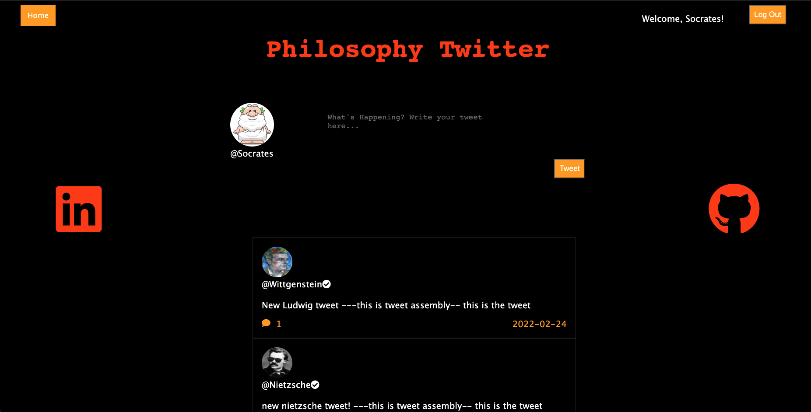
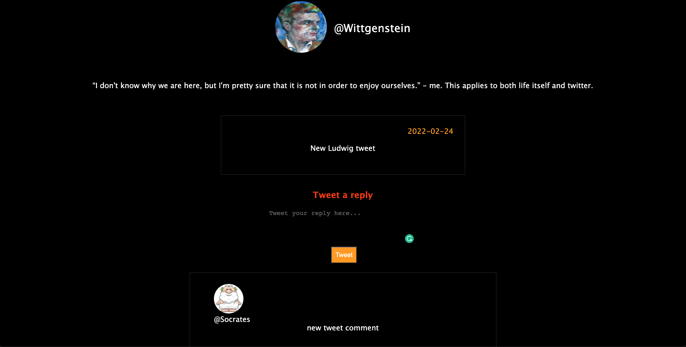

# philosophyHQ

By: Maxim Grigg

PhilosophyHq is a full stack application using PSQL, Express.js in the backend, and React.js in the frontend.
The application allows useres to interact with famous philosphers, dead and alive, by reading tweets, reading tweet replys, as well as
creating, editing, and deleting tweets and replies.

On the FrontEnd:
React:
React was used to handle all frontend logic and design.

Redux:
Redux is used to handle all state management by use of actions and thunks making API calls to the backend for data from the server.

CSS:
All styling was done with the use of vanilla CSS.

On the Backend:
Express.js:
Express.js was used to make the API's and connect the data base to the front end for a smooth user experience.

PostgresSQL:
PostgresSQL was the database used to build seeder files and easily manage database constarinsts and customization.

Sequelize:
All table management and data was managed with the use of sequelize.

Image gallery of the apps flow:

Signup / splash page:

Main page:

Single tweets page that holds that tweets comments, as well as the tweets and comments edit and delete functions:

